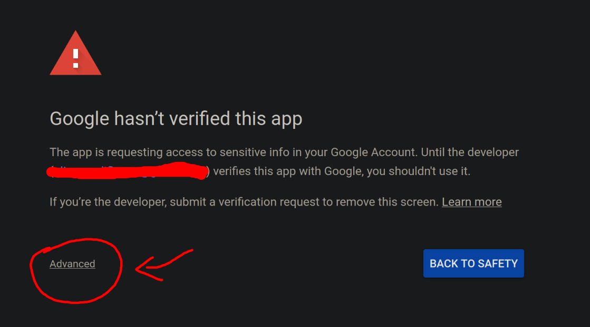
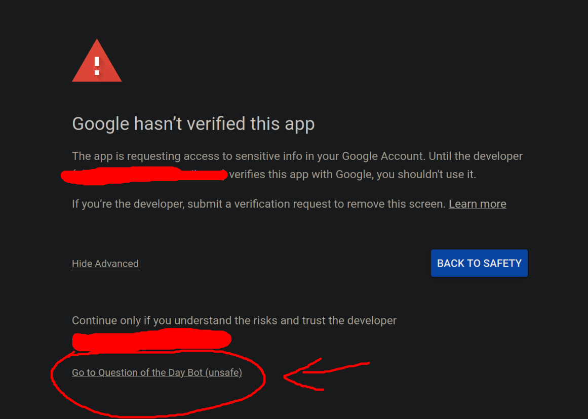

# TUTORIAL

### TABLE OF CONTENTS
1. [important notes](#important-notes)
2. [prerequisites](#prerequisites)
3. [1. set up the bot](#1-set-up-the-bot)
4. [2. move to vps and deploy](#2-move-to-vps-or-heroku-and-deploy)

## IMPORTANT NOTES
There are two different ways I would typically host a Discord bot. The first is using a service like Heroku. the second is using a private server in the cloud (also called a VPS). Both of these cost money. The way you would set up a Discord bot to run differs a lot depending on what you're using--something like Heroku would be more intuitive since you are using a GUI, while VPSes often require you to have some basic knowledge of terminal. This tutorial focuses on setting up a bot using a VPS service like [Contabo](https://contabo.com/en), but if you are using Heroku, it will only make a difference starting in the <u>second section of the tutorial.</u> You will still need to complete all the steps in the prerequisites as well as the first part of the tutorial.


## PREREQUISITES
You will need:
1. a VPS or other host, like Heroku.
2. [git](https://git-scm.com/book/en/v2/Getting-Started-Installing-Git) and [node.js](https://nodejs.org/en) installed in your VPS/host as well as in a terminal of your choice on the computer you are using to set up the bot.
    - To install these dependencies on your VPS, open up a terminal application and `ssh username@server` into your VPS. Then, you will want to run the command `sudo apt install git-all` (if it isn't already installed) and `sudo apt install nodejs`. This will work if your VPS is running **Ubuntu Linux**, which most do, but if it uses something different, the commands will be slightly different.
3. A way to transfer files to your VPS. I usually transfer files using the terminal by running `scp username@server:[destination file path] [source you want transferred file path]`. You can also typically set up [FileZilla](https://filezilla-project.org/) to transfer files in a much more intuitive way, but I wouldn't know the specific instructions for that.

## 1. SET UP THE BOT
1. Clone this repo to your computer (NOT to the VPS). 
    - You can do that by opening up a terminal with git installed, navigating to the folder you want to contain the `qotd-michael-bot` folder, and pasting `git clone https://github.com/olicauli/qotd-michael-bot.git` into the terminal. Make sure you have git installed.
    - If you are on a Windows computer, you likely will not have git installed already. [Git for Windows](https://gitforwindows.org/) gives you a basic bash terminal capable of running git. You can use this as your terminal, but if it doesn't work, [WSL](https://learn.microsoft.com/en-us/windows/wsl/install) also works.
2. In a terminal application, navigate to the `qotd-michael-bot` folder created when you cloned the repo and run `npm install`.
3. In the `qotd-michael-bot` folder, create a file named `.env` with <u>no ending file extension</u>. So, it should not be `.env.txt`; just `.env`.
    - You can do this easily in a terminal by running `touch .env` in the `qotd-michael-bot` folder.
3. In the `.env` file, paste the code below. Remove the brackets and replace the text inside them with your Discord bot's Client ID and Bot Token.
    ```
    CLIENT_ID=[YOUR BOT'S CLIENT ID]
    TOKEN=[YOUR BOT'S TOKEN]
    ```
4. In order for the bot to run, you need one additional file: `credentials.json`. [Follow the Google instructions linked here from the beginning](https://developers.google.com/sheets/api/quickstart/nodejs) up to <u>just before</u> the `Install the client library` section and then return to this tutorial. Rename the credentials file you downloaded to `credentials.json` and move it into the `qotd-michael-bot` folder.
5. Back in your terminal application, make sure you are in the `qotd-michael-bot` folder and run the command `npm run set-up`.
6. Follow the prompts from the terminal.
    - [Guide for enabling Discord Developer Mode](https://www.howtogeek.com/714348/how-to-enable-or-disable-developer-mode-on-discord/)
    - [Guide for pasting into terminal](https://itsfoss.com/copy-paste-linux-terminal/)
7. Once the config.json is set up, the bot will log in. Your default web browser will automatically open up a google verification page. Choose an account that has access to the QOTD Spreadsheet, and you will get a "Google hasn't verified this app" page. **This is normal.**
8. Press "Advanced".
    
9. Press "Go to [whatever you named your google bot-application]".
    
10. Press "Continue".
11. This will generate a `token.json` file that your bot application <u>will need to access the spreadsheet.</u>. You can safely stop the bot now by selecting the terminal it's running in and pressing `Ctrl + C`.

## 2. MOVE TO VPS OR HEROKU AND DEPLOY

### FOR VPS
You can either use the terminal or configure FileZilla to allow you to transfer files. I do not have filezilla figured out, but I can describe how you would move it onto your VPS and then deploy it.

1. Navigate to the folder that contains your `qotd-michael-bot` folder in terminal, and run `scp -r username@server:./ ./qotd-michael-bot` OR use FileZilla to transfer your folder into the home directory of `username`'s account in the VPS.
2. Run `ssh username@server` to ssh into your VPS.
3. Run `cd qotd-michael-bot` to navigate into the folder that contains the bot.
4. Run `pm2 start index.js --name michael-bot`
    - [PM2 QuickStart document with different commands you can use to start, restart, list, and stop the PM2 service](https://pm2.keymetrics.io/docs/usage/quick-start/)
5. Your bot is now up and running! :]

### FOR HEROKU
I have not used Heroku in a while, so I don't think I'd be able to write an accurate tutorial for it, but I do have this resource.
- Most of what you'll do differently is after moving the folder to Heroku, you would set up Environment Variables through Heroku's menu.
Refer to this tutorial: https://www.studytonight.com/post/how-to-deploy-a-discord-bot-to-heroku